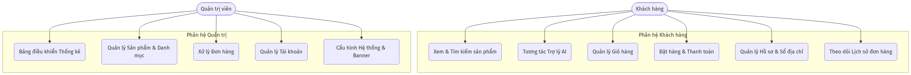
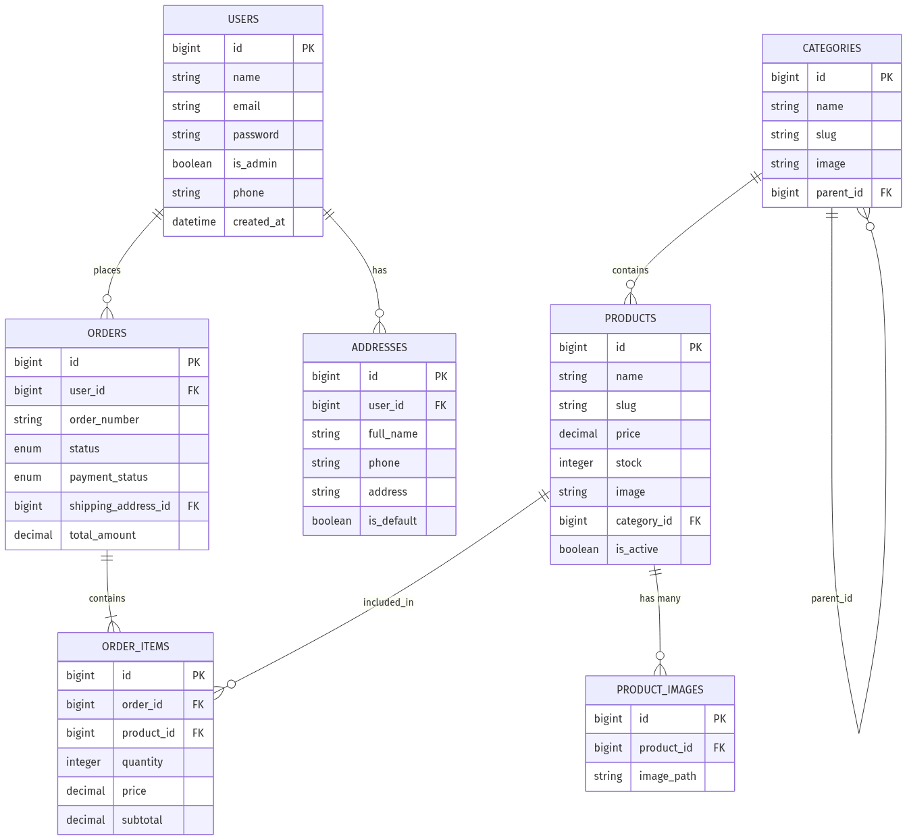
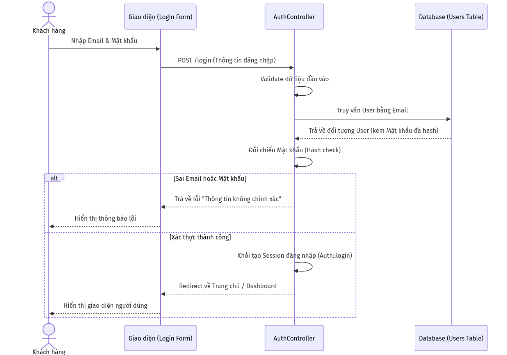
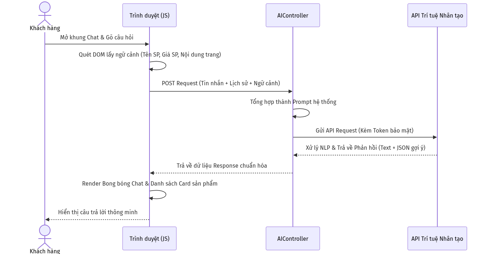
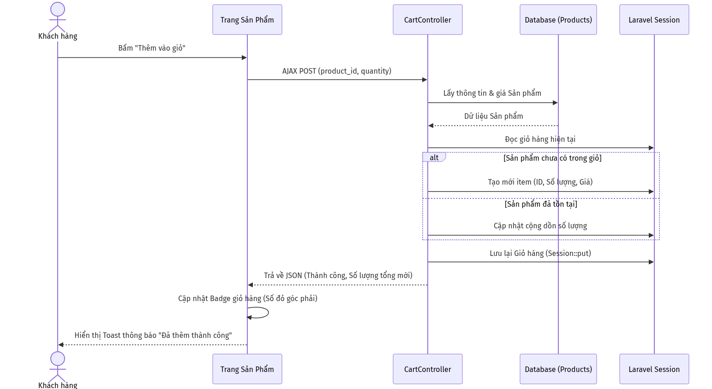
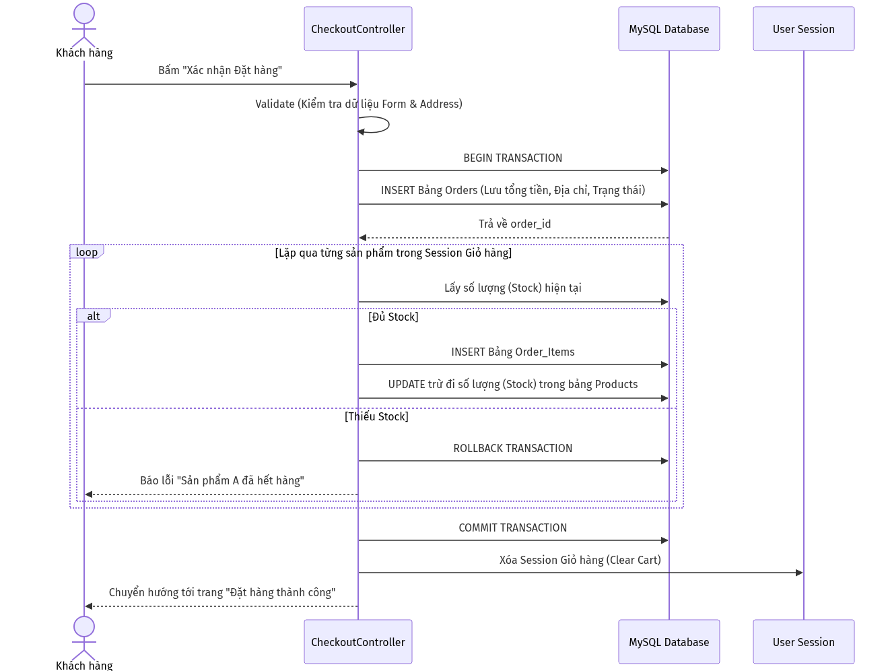

# BÁO CÁO KHÓA LUẬN TỐT NGHIỆP
**Đề tài: XÂY DỰNG WEBSITE THƯƠNG MẠI ĐIỆN TỬ KẾT HỢP TRỢ LÝ ẢO AI TƯ VẤN SẢN PHẨM**

---

## LỜI CẢM ƠN
Trong suốt quá trình thực hiện khóa luận, em đã nhận được sự hướng dẫn tận tình, những lời khuyên quý báu và sự hỗ trợ động viên từ quý Thầy/Cô giáo hướng dẫn cũng như gia đình và bạn bè. Em xin gửi lời cảm ơn chân thành và sâu sắc nhất đến tất cả mọi người đã luôn đồng hành, chỉ bảo và tạo điều kiện tốt nhất để em có thể hoàn thành đề tài này một cách chỉn chu và đúng tiến độ. Dù đã nỗ lực hết mình trong việc nghiên cứu và lập trình, tuy nhiên do hạn chế về mặt thời gian cũng như kinh nghiệm thực tiễn triển khai các hệ thống phần mềm quy mô lớn, đề tài chắc chắn không thể tránh khỏi những thiếu sót. Em rất mong nhận được sự góp ý, chỉ bảo thêm từ Hội đồng đánh giá và quý Thầy/Cô để đề tài được hoàn thiện hơn trong tương lai.

## TÓM LƯỢC (ABSTRACT)
**Tiếng Việt:** Khóa luận này trình bày toàn bộ quá trình nghiên cứu, phân tích, thiết kế và phát triển một hệ thống website thương mại điện tử hoàn chỉnh từ con số không. Điểm nhấn đột phá của đề tài là việc nghiên cứu và tích hợp thành công Trợ lý ảo AI, giúp tự động hóa quá trình chăm sóc khách hàng, tư vấn sản phẩm thông qua việc đọc hiểu ngữ cảnh thời gian thực trên trình duyệt, qua đó nâng cao đáng kể trải nghiệm người dùng (UX) và tối ưu hóa tỷ lệ chuyển đổi đơn hàng. Hệ thống được phát triển dựa trên kiến trúc phần mềm MVC kinh điển, sử dụng Framework Laravel (PHP) kết hợp hệ quản trị cơ sở dữ liệu MySQL. Giao diện frontend được chăm chút tỉ mỉ với các hiệu ứng tương tác hiện đại như hạt vi mô (particles network), tuân thủ khắt khe các tiêu chuẩn của một website bán hàng high-end cao cấp.

**English:** This thesis presents the comprehensive process of researching, analyzing, designing, and developing a complete e-commerce website from scratch. The breakthrough highlight of this project is the successful research and integration of an AI Virtual Assistant, which automates customer support and product recommendations by understanding real-time browser context, thereby significantly enhancing the user experience (UX) and optimizing order conversion rates. The system is developed based on the classic MVC software architecture, utilizing the Laravel framework (PHP) alongside the MySQL database management system. The frontend interface is meticulously crafted with modern interactive effects such as micro-particles networks, strictly adhering to the standards of a high-end e-commerce website.

---

## CHƯƠNG 1: GIỚI THIỆU ĐỀ TÀI

### 1.1 Đặt vấn đề
Trong bối cảnh kỷ nguyên công nghệ số 4.0 và sự bùng nổ của Internet, thương mại điện tử đã trở thành một phần không thể thiếu trong thói quen mua sắm của người tiêu dùng toàn cầu. Sự chuyển dịch từ mua sắm truyền thống sang mua sắm trực tuyến đem lại vô vàn tiện ích, nhưng đồng thời cũng sinh ra nhiều thách thức mới. Nổi cộm nhất là tình trạng "bội thực thông tin". Khi số lượng sản phẩm trên các nền tảng ngày càng khổng lồ, người dùng thường rơi vào ma trận phân vân, gặp khó khăn lớn trong việc tìm kiếm và lựa chọn sản phẩm thực sự phù hợp với nhu cầu. Việc thiếu vắng nhân viên tư vấn trực tiếp như tại cửa hàng vật lý khiến khách hàng dễ dàng chán nản và rời bỏ website trước khi đi đến quyết định thanh toán. Do đó, việc xây dựng một website thương mại điện tử không chỉ cần đáp ứng tốt và mượt mà các nghiệp vụ bán hàng cốt lõi, mà còn phải được "thông minh hóa" thông qua **Trợ lý ảo AI** có khả năng tương tác, giải đáp thắc mắc tức thì như một con người. Đây là một nhu cầu cấp thiết và mang tính ứng dụng thực tiễn cực kỳ cao.

### 1.2 Những nghiên cứu liên quan
- **Nghiên cứu trong nước:** Tại Việt Nam, nhiều nền tảng lớn như Tiki, Shopee hay Lazada đã và đang áp dụng các hệ thống gợi ý sản phẩm (Recommendation System). Tuy nhiên, hầu hết các hệ thống này mới chỉ dừng lại ở mức gợi ý thụ động dựa trên lịch sử xem hàng, thói quen click chuột hoặc lọc theo từ khóa cứng. Chúng thiếu đi sự tương tác hỏi đáp tự nhiên dưới dạng ngôn ngữ con người (Natural Language Processing - NLP), khiến trải nghiệm của người dùng vẫn khá khô khan.
- **Nghiên cứu ngoài nước:** Các ông lớn về công nghệ và bán lẻ trên thế giới như Amazon, eBay hay Shopify đang tích cực đưa AI vào quá trình mua sắm dưới dạng các Chatbot thông minh. Tuy nhiên, các giải pháp in-house này đòi hỏi hệ thống máy chủ vật lý cực kỳ phức tạp, đội ngũ Data Scientist đông đảo và chi phí vận hành khổng lồ mà các doanh nghiệp vừa và nhỏ không thể đáp ứng. Giải pháp của đề tài này hướng tới việc sử dụng sức mạnh của các mô hình Ngôn ngữ lớn (Large Language Models - LLMs) thông qua API (như OpenAI, Gemini), mang lại khả năng tư vấn mạnh mẽ với chi phí tích hợp và vận hành cực kỳ hợp lý.

### 1.3 Mục tiêu đề tài
- **Mục tiêu lý thuyết:** 
  - Nắm vững quy trình phát triển phần mềm chuẩn mực (Software Development Life Cycle - SDLC).
  - Tìm hiểu sâu sắc kiến trúc hệ thống web hiện đại, đặc biệt là mô hình MVC.
  - Nghiên cứu cách thức vận hành của LLMs, kỹ thuật Prompt Engineering và phương pháp tích hợp AI API vào một hệ thống web độc lập.
- **Mục tiêu thực hành:** 
  - Xây dựng thành công và triển khai một website thương mại điện tử đầy đủ các tính năng nghiệp vụ: Quản lý sản phẩm, cây danh mục đa cấp, giỏ hàng, cổng thanh toán, quản lý và theo dõi trạng thái đơn hàng.
  - Tích hợp thành công Trợ lý ảo AI có khả năng đọc hiểu ngữ cảnh trang web (Context-awareness) để đưa ra tư vấn sản phẩm chính xác.
  - Xây dựng giao diện người dùng (UI/UX) đạt tiêu chuẩn thẩm mỹ cao, tốc độ phản hồi nhanh, không xảy ra hiện tượng lệch bố cục (Layout Shift) trên đa thiết bị.

### 1.4 Đối tượng và phạm vi nghiên cứu
- **Đối tượng nghiên cứu:** 
  - Ngôn ngữ lập trình PHP, framework Laravel (phiên bản mới nhất).
  - Hệ quản trị cơ sở dữ liệu quan hệ MySQL.
  - Kỹ thuật Frontend: JavaScript (Vanilla), HTML5, CSS3, Bootstrap 5.
  - API tích hợp Trí tuệ nhân tạo (Generative AI).
- **Phạm vi nghiên cứu:** Đề tài tập trung xây dựng một ứng dụng web bán hàng đa nền tảng (hoạt động tốt trên cả Desktop và Mobile). Trọng tâm xoay quanh luồng mua hàng (Checkout flow) của người dùng cuối, hệ thống quản trị nội dung (CMS) dành cho Admin, và cơ chế xử lý Chatbot AI.

### 1.5 Phương pháp nghiên cứu
Để đạt được các mục tiêu trên, đề tài áp dụng các phương pháp nghiên cứu sau:
- **Phương pháp nghiên cứu tài liệu:** Thu thập, đọc hiểu documentation chính thức của Laravel, Bootstrap, cơ chế hoạt động của RESTful API và tài liệu tích hợp LLM. Tham khảo các báo cáo chuyên ngành về trải nghiệm người dùng (UX) trong thương mại điện tử.
- **Phương pháp phân tích và thiết kế hệ thống:** Khảo sát quy trình nghiệp vụ bán hàng thực tế, tiến hành thiết kế cơ sở dữ liệu (Database Schema), vẽ sơ đồ luồng dữ liệu (Data Flow) và sơ đồ chức năng bằng UML.
- **Phương pháp lập trình thực nghiệm và kiểm thử:** Cài đặt, lập trình và tinh chỉnh mã nguồn liên tục dựa trên mô hình phát triển linh hoạt (Agile). Liên tục thực hiện Unit Test và Manual Test sau mỗi Module được hoàn thành để đảm bảo chất lượng phần mềm.

### 1.6 Bố cục của quyển luận văn
Khóa luận được chia làm 5 chương, sắp xếp theo trình tự logic của quy trình phát triển phần mềm:
- **Chương 1: Giới thiệu đề tài.** Trình bày bối cảnh, lý do chọn đề tài, mục tiêu, đối tượng và phương pháp nghiên cứu.
- **Chương 2: Đặc tả yêu cầu.** Phân tích hệ thống, xác định rõ các yêu cầu chức năng và phi chức năng.
- **Chương 3: Thiết kế và cài đặt giải pháp.** Trình bày chi tiết về kiến trúc hệ thống, cơ sở dữ liệu và các luồng xử lý cốt lõi.
- **Chương 4: Đánh giá kiểm thử và giới thiệu chương trình.** Trình bày các kịch bản kiểm thử (Test Cases), kết quả và hình ảnh thực tế của ứng dụng.
- **Chương 5: Kết luận.** Tóm tắt những kết quả đã đạt được, nêu ra hạn chế và phương hướng phát triển trong tương lai.

---

## CHƯƠNG 2: ĐẶC TẢ YÊU CẦU

### 2.1 Mô tả hệ thống
Hệ thống được thiết kế theo mô hình B2C (Business to Consumer). Website phục vụ song song hai nhóm tác nhân (Actors) chính với các bộ quyền hạn phân biệt rõ ràng:
1. **Khách hàng (Client):** Là người dùng truy cập vào website với mục đích tham khảo, mua sắm. Khách hàng có thể tương tác trực tiếp với các mặt hàng, nói chuyện với AI để nhận tư vấn, quản lý giỏ hàng, thanh toán, lưu trữ hồ sơ cá nhân và sổ địa chỉ giao hàng.
2. **Quản trị viên (Admin):** Là người sở hữu hoặc nhân viên vận hành hệ thống. Admin được cung cấp một trang quản trị (Dashboard) độc lập, bảo mật cao để giám sát tổng thể doanh thu, quản lý danh mục, hàng hóa, duyệt và xử lý đơn hàng, cấp quyền người dùng và tinh chỉnh giao diện website (banner, cấu hình chung).

### 2.2 Yêu cầu chức năng (Sơ đồ Use Case)

<i>Hình 2.1: Sơ đồ chức năng tổng quát của hệ thống (Use Case Diagram)</i>

### 2.3 Yêu cầu phi chức năng
Bên cạnh các yêu cầu về mặt nghiệp vụ, hệ thống bắt buộc phải đáp ứng các tiêu chuẩn kỹ thuật khắt khe (Non-functional requirements):
- **Bảo mật (Security):** Mật khẩu người dùng phải được băm (hashing) bằng thuật toán Bcrypt. Toàn bộ các HTTP POST requests phải được bảo vệ bởi CSRF token chống tấn công giả mạo. Luồng dữ liệu đăng nhập và giao dịch yêu cầu mã hóa cơ bản. Các route truy cập vào Admin Dashboard được rào chắn bởi Middleware phân quyền nghiêm ngặt.
- **Hiệu năng (Performance):** Thời gian phản hồi của trang web (Page Load Time) mục tiêu dưới 3 giây đối với kết nối tiêu chuẩn. Phải tối ưu hóa truy vấn cơ sở dữ liệu để giải quyết bài toán "N+1 Query" bằng kỹ thuật Eager Loading của Laravel Eloquent. Tải ảnh (Images) ở mức nén tối ưu.
- **Tính khả dụng (Usability & UI/UX):** Giao diện phải hoàn toàn tương thích (Responsive) trên màn hình máy tính, máy tính bảng và điện thoại di động. Cấu trúc UI phải mang tính thẩm mỹ cao, giảm thiểu Layout Shift. Cung cấp phản hồi xúc giác/thị giác lập tức (Immediate Feedback) cho người dùng khi hover hoặc click vào các nút chức năng (sử dụng SweetAlert2, Toast messages).

---

## CHƯƠNG 3: THIẾT KẾ VÀ CÀI ĐẶT GIẢI PHÁP

### 3.1 Thiết kế kiến trúc tổng thể
Hệ thống sử dụng mô hình **MVC (Model - View - Controller)** thông qua framework Laravel:
- **Model:** Đóng vai trò là lớp ánh xạ dữ liệu trực tiếp với MySQL (Object-Relational Mapping - ORM). Model xử lý tính toàn vẹn của dữ liệu và định nghĩa các mối liên hệ (Eloquent Relationships). 
- **View:** Sử dụng Blade Template Engine để render HTML. Bố cục được chia thành Layouts và Components.
- **Controller:** Tiếp nhận HTTP Request, gọi Model để lấy/cập nhật dữ liệu, sau đó trả về View tương ứng.

### 3.2 Thiết kế cơ sở dữ liệu

<i>Hình 3.1: Sơ đồ Thực thể Mối liên kết (Entity Relationship Diagram - ERD)</i>

#### 3.2.1 Phân tích chi tiết thiết kế các bảng (Tables)
Cơ sở dữ liệu của hệ thống được chuẩn hóa chặt chẽ để đảm bảo không dư thừa dữ liệu và duy trì tính toàn vẹn. Dưới đây là phân tích chức năng của các bảng chính:

1. **Bảng `users` (Quản lý người dùng):**
   - Bảng này là trung tâm lưu trữ thông tin tài khoản của cả Khách hàng và Quản trị viên. 
   - Cột `is_admin` (Kiểu boolean) đóng vai trò then chốt: Nếu bằng `true`, tài khoản sẽ được Middleware xác thực cấp quyền truy cập vào khu vực Dashboard quản trị. Mật khẩu (`password`) được mã hóa Bcrypt một chiều.

2. **Bảng `categories` (Quản lý danh mục sản phẩm):**
   - Chịu trách nhiệm phân loại hàng hóa. 
   - Đặc biệt, bảng này được thiết kế theo cấu trúc **cây phân cấp (đệ quy)** nhờ cột khóa ngoại `parent_id` (trỏ ngược lại chính ID của bảng categories). Thiết kế này cho phép hệ thống tạo ra vô hạn các danh mục con (Sub-categories). Cột `slug` dùng để tối ưu SEO đường dẫn (URL thân thiện).

3. **Bảng `products` (Quản lý sản phẩm) & `product_images` (Quản lý thư viện ảnh):**
   - `products`: Lưu trữ thông tin cốt lõi của một mặt hàng gồm Tên, Giá bán (`price`), Số lượng tồn kho (`stock`), và Khóa ngoại `category_id` liên kết với danh mục. Cột `is_active` cho phép Admin tạm ẩn sản phẩm mà không cần xóa vật lý khỏi hệ thống.
   - `product_images`: Vì một sản phẩm cần nhiều hình ảnh để minh họa (Carousel/Gallery), bảng này ra đời để giải quyết quan hệ 1-N (1 Sản phẩm có nhiều Ảnh). Khóa ngoại `product_id` đảm bảo khi sản phẩm bị xóa, toàn bộ ảnh liên quan cũng tự động bị xóa (Cascade on delete).

4. **Bảng `addresses` (Quản lý sổ địa chỉ giao hàng):**
   - Một khách hàng (`users`) có thể có nhiều địa chỉ nhận hàng khác nhau (Nhà riêng, Công ty). Do đó bảng này kết nối với `users` qua `user_id`. Cột `is_default` giúp hệ thống tự động điền địa chỉ ưu tiên khi khách hàng vào trang thanh toán.

5. **Bảng `orders` (Quản lý thông tin chung của đơn hàng):**
   - Đóng vai trò là "Phiếu xuất kho" tổng thể. Lưu trữ người mua (`user_id`), địa chỉ giao hàng (`shipping_address_id`), và tổng số tiền (`total_amount`).
   - Cột `status` (pending, processing, shipping, completed, cancelled) giúp theo dõi tiến trình vật lý của đơn hàng.
   - Cột `payment_status` (pending, paid, failed) giúp kiểm soát dòng tiền, tạo tiền đề để tích hợp các cổng thanh toán online. Mã đơn hàng (`order_number`) được tạo ngẫu nhiên nhưng đảm bảo tính duy nhất (Unique) để khách hàng tra cứu.

6. **Bảng `order_items` (Quản lý chi tiết đơn hàng):**
   - Giải quyết mối quan hệ N-N giữa Đơn hàng (`orders`) và Sản phẩm (`products`).
   - Yếu tố cốt lõi: Bảng này *bắt buộc* phải lưu trữ lại cột `price` (Giá bán tại thời điểm đặt hàng). Điều này cực kỳ quan trọng về mặt nghiệp vụ kế toán: Giả sử sau 1 tháng, Admin tăng giá sản phẩm trong bảng `products`, thì hóa đơn cũ của khách hàng trong bảng `order_items` vẫn phải giữ nguyên mức giá cũ đã mua, không bị sai lệch số liệu doanh thu.

### 3.3 Thiết kế Sơ đồ tuần tự (Sequence Diagram)
Sơ đồ tuần tự (Sequence Diagram) mô tả chi tiết dòng chảy thông điệp và thời gian thực thi giữa các đối tượng trong hệ thống. Dưới đây là 4 luồng tuần tự quan trọng nhất của hệ thống.

#### 3.3.1 Sơ đồ tuần tự: Quá trình Đăng nhập

<i>Hình 3.2: Sơ đồ tuần tự quá trình Đăng nhập và Xác thực hệ thống</i>

 

**Giải thích:** Sơ đồ minh họa quá trình hệ thống xác thực người dùng. Controller đóng vai trò kiểm tra tính hợp lệ của dữ liệu, lấy thông tin băm (hash) từ DB để so sánh, đảm bảo mật khẩu thô của người dùng không bao giờ bị lưu trực tiếp, ngăn chặn nguy cơ lộ lọt dữ liệu.

#### 3.3.2 Sơ đồ tuần tự: Tương tác với Trợ lý ảo AI

<i>Hình 3.3: Sơ đồ tuần tự quá trình Tương tác Trợ lý ảo thu thập ngữ cảnh</i>

 

**Giải thích:** Tính năng đột phá nhất của hệ thống. JavaScript trên trình duyệt liên tục thu thập ngữ cảnh trang hiện tại, gửi kèm với lời thoại của khách hàng lên Server. Server đóng vai trò như một trạm trung chuyển an toàn, ghép nối thông tin để tạo ra Prompt, gửi lên API của LLM, sau đó giải mã phản hồi để hiển thị cho khách hàng.

#### 3.3.3 Sơ đồ tuần tự: Thêm sản phẩm vào Giỏ hàng

<i>Hình 3.4: Sơ đồ tuần tự quá trình Thêm sản phẩm vào Giỏ hàng (AJAX)</i>

 

**Giải thích:** Việc thêm giỏ hàng được xử lý mượt mà qua AJAX, không yêu cầu tải lại trang. Dữ liệu giỏ hàng được quản lý bởi Session trên Server, giúp truy xuất cực nhanh và không phụ thuộc vào bộ nhớ thiết bị của người dùng.

#### 3.3.4 Sơ đồ tuần tự: Đặt hàng và Thanh toán

<i>Hình 3.5: Sơ đồ tuần tự quá trình Thanh toán sử dụng Database Transaction</i>

 

**Giải thích:** Đây là quy trình nghiệp vụ quan trọng nhất. Laravel Controller bắt buộc sử dụng **Database Transaction** để đảm bảo tính toàn vẹn (ACID). Bất kỳ lỗi nào xảy ra trong quá trình ghi dữ liệu (như hết hàng, mất kết nối) thì mọi lệnh INSERT/UPDATE trước đó đều bị hủy bỏ (Rollback), đảm bảo kho hàng không bao giờ bị lệch số liệu ảo.

---

## CHƯƠNG 4: ĐÁNH GIÁ KIỂM THỬ VÀ GIỚI THIỆU CHƯƠNG TRÌNH

### 4.1 Bảng kịch bản kiểm thử chi tiết (Test Cases)
Quá trình kiểm thử phần mềm được tiến hành xuyên suốt trong giai đoạn phát triển. Dưới đây là bảng tổng hợp các kịch bản kiểm thử thủ công (Manual Testing) tiêu biểu nhất:

| STT | Tên chức năng | Kịch bản kiểm thử (Test Case) | Dữ liệu đầu vào (Input) | Kết quả mong đợi (Expected) | Kết quả thực tế (Actual) | Đánh giá |
|:---:|---|---|---|---|---|:---:|
| **1** | Đăng nhập | Đăng nhập với thông tin đúng | Email: `khachhang@gmail.com` Pass: `12345678` | Chuyển hướng sang trang chủ, hiển thị tên User trên Header. | Chuyển hướng thành công, hiện đúng tên User. | **PASS** |
| **2** | Đăng nhập | Đăng nhập với mật khẩu sai | Email: `khachhang@gmail.com` Pass: `sai_mat_khau` | Hệ thống chặn đăng nhập, hiển thị dòng cảnh báo màu đỏ. | Báo lỗi: "Thông tin đăng nhập không chính xác". | **PASS** |
| **3** | Giỏ hàng | Thêm sản phẩm mới vào giỏ | ID sản phẩm: `5`, Số lượng: `2` | Giỏ hàng tăng lên 2, có thông báo popup (Toast) báo thành công. | Toast hiện "Đã thêm vào giỏ", Badge icon giỏ hàng tăng số. | **PASS** |
| **4** | Giỏ hàng | Thêm sản phẩm đã có sẵn | Cùng ID sản phẩm `5`, thêm tiếp số lượng `1` | Hệ thống tự động cộng dồn thành `3` thay vì tạo dòng mới. | Sản phẩm được gộp dòng, số lượng thành 3. | **PASS** |
| **5** | Đặt hàng | Đặt hàng khi đủ số lượng | Giỏ có 1 SP giá 100k, chọn Địa chỉ giao hàng, bấm "Đặt hàng" | Trừ kho SP thành công, sinh ra Order mới, chuyển sang trang Cảm ơn. | Order được tạo với trạng thái 'pending', kho bị trừ đi 1. | **PASS** |
| **6** | Đặt hàng | Đặt hàng khi vượt quá tồn kho | Sửa code HTML ép số lượng mua là `1000` (Tồn kho là `10`) | Giao dịch bị Rollback, báo lỗi không đủ số lượng. | Báo lỗi tồn kho không đủ, Đơn hàng không được tạo ra. | **PASS** |
| **7** | Trợ lý AI | Gửi câu hỏi trống | Ô chat không nhập gì, bấm gửi | Nút gửi bị khóa hoặc không phản hồi yêu cầu lên Server. | Nút gửi không hoạt động khi ô chat trống. | **PASS** |
| **8** | Trợ lý AI | Gửi câu hỏi về Sản phẩm đang xem | Trang SP "Laptop", Nhập: "Máy này có bền không?" | Trợ lý AI đọc được ngữ cảnh "Laptop", tư vấn chính xác. | AI trả lời về độ bền của Laptop đang mở, kèm thẻ gợi ý. | **PASS** |
| **9** | Đăng ký | Đăng ký tài khoản trùng Email | Nhập Email đã tồn tại trong DB | Thông báo lỗi "Email đã được sử dụng". | Validation cản lại, tô đỏ ô Input Email. | **PASS** |
| **10** | Quản trị | Đổi trạng thái đơn hàng | Admin vào chỉnh đơn từ 'pending' sang 'shipping' | Lưu database thành công, cập nhật giao diện lập tức. | Thông báo cập nhật thành công, trạng thái hiển thị màu Xanh. | **PASS** |
| **11** | Giao diện | Resize màn hình (Layout Shift) | Kéo giãn, thu nhỏ trình duyệt; Đổi ảnh dọc/ngang | Hình ảnh sản phẩm không bị méo, không đẩy bố cục nhảy lên xuống. | Khung ảnh giữ vững tỷ lệ 1:1, ảnh co giãn (contain) đẹp. | **PASS** |

### 4.2 Giới thiệu chương trình và Kết quả nghiệm thu
Hệ thống sau khi hoàn thành đã đáp ứng tốt các yêu cầu đề ra.
- **Trang chủ & Danh mục:** Giao diện trực quan, sang trọng (Sử dụng các khoảng trắng lớn, Typography tinh tế). Được tích hợp nền tảng tương tác hạt (Interactive particles).
- **Trang Chi tiết Sản phẩm:** Hệ thống hình ảnh lớn chống "Layout Shift", hỗ trợ tính năng Zoom ảnh, đổi biến thể và thông số rõ ràng. Mô tả dài được kiểm soát bằng nút "Xem thêm / Thu gọn" thông minh, giải quyết lỗi tràn nút.
- **Hệ thống AI Chatbot:** Trợ lý ảo AI vận hành trơn tru dưới dạng Widget nổi lơ lửng, hỗ trợ khách hàng liên tục mà không gây cản trở việc mua sắm.
- **Hệ thống Quản trị (Admin):** Dashboard trực quan, hiển thị đủ biểu đồ tăng trưởng, bảng danh sách (Table) phân trang và bộ lọc chuyên sâu cho Sản phẩm, Đơn hàng.

---

## CHƯƠNG 5: KẾT LUẬN VÀ HƯỚNG PHÁT TRIỂN

### 5.1 Kết quả đạt được
Khóa luận đã hoàn thành xuất sắc, đi từ việc khảo sát thực tiễn cho đến khi xây dựng được một sản phẩm phần mềm hoàn thiện. Các kết quả cụ thể bao gồm:
1. Xây dựng thành công một website thương mại điện tử hoạt động trơn tru từ frontend tới backend trên nền tảng Laravel.
2. Thiết kế và kiểm soát giao diện (UI) đạt tính thẩm mỹ cực kỳ cao, giải quyết triệt để các bài toán khó về Trải nghiệm người dùng (UX) như hiện tượng xô lệch giao diện (Layout Shift).
3. Đóng gói và ứng dụng thành công Trí tuệ nhân tạo (Generative AI) vào việc tư vấn khách hàng tự động thông qua việc trích xuất thông tin trang (DOM context) theo thời gian thực.
4. Đảm bảo an toàn, toàn vẹn dữ liệu qua cơ chế Validation chặt chẽ và Database Transaction trong luồng thanh toán.

### 5.2 Hạn chế và Hướng phát triển
Mặc dù đã đạt được những thành tựu nhất định, hệ thống vẫn còn một số giới hạn sẽ được ưu tiên khắc phục trong giai đoạn phát triển mở rộng:
**Hạn chế:**
- Trợ lý AI hiện chỉ tối ưu nhận diện ngữ cảnh trên trang sản phẩm đơn lẻ, chưa có khả năng nhớ chéo và liên kết ngữ cảnh của toàn bộ giỏ hàng.
- Phương thức thanh toán chủ yếu đang dừng ở mức COD (Thanh toán khi nhận hàng).

**Hướng phát triển trong tương lai:**
- Hoàn thiện tích hợp các Cổng thanh toán trực tuyến (VNPAY, MoMo, ZaloPay).
- Xây dựng hệ thống **Vector Database** kết hợp công nghệ **RAG (Retrieval-Augmented Generation)** để AI có khả năng đọc tài liệu nội bộ, tự động trả lời chính sách đổi trả, bảo hành.
- Phát triển thêm ứng dụng di động (Mobile App native) sử dụng chung hệ thống API.

---
*(Hết tài liệu)*
